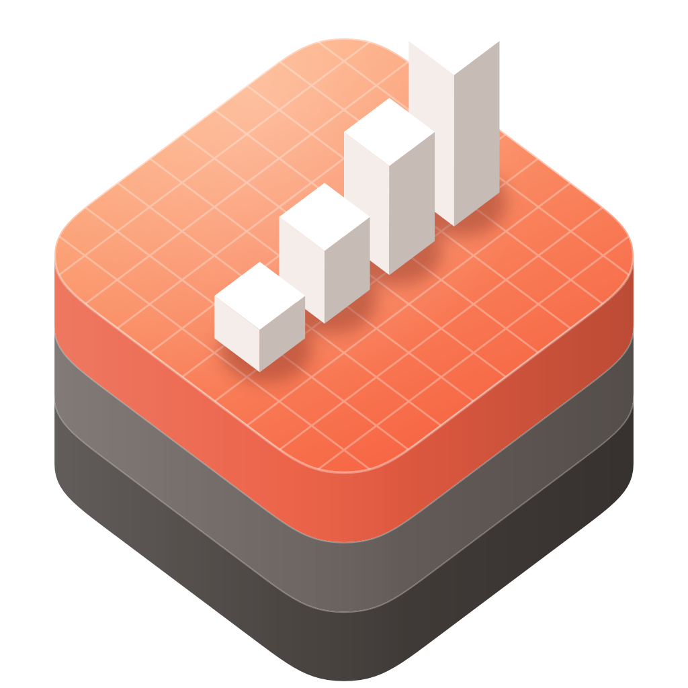
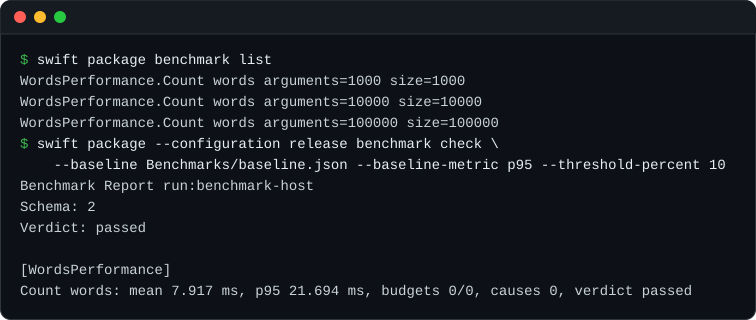

<p align="center">
  
</p>

<h1 align="center">swift-benchmark</h1>

<p align="center">
  Runtime instrumentation, repeatable benchmarks, and structured performance reports for Swift packages.
</p>

<p align="center">
  <a href="https://github.com/swift-library/swift-benchmark/actions/workflows/ci.yml"></a>
  
  
  <a href="LICENSE"></a>
</p>

[Overview](#overview) · [Install](#install) · [Quick start](#quick-start) ·
[Products](#products) · [Usage](#usage) · [Requirements](#requirements) ·
[Documentation](#documentation) · [License](#license)

> [!NOTE]
> swift-benchmark is pre-1.0. Minor releases may include source-breaking
> changes, so depend on it with `.upToNextMinor(from:)`.

## Overview

swift-benchmark measures Swift code the way Swift Testing tests it. Declare a
benchmark next to your tests with a trait, run it with
`swift package benchmark`, and keep the JSON report as a baseline that CI can
check. The spans you add for profiling in production appear in the same report
as a timeline, and in Instruments through Apple Signpost.

- Benchmarks declared with Swift Testing traits, or with native
  `@BenchmarkSuite` and `@Benchmark` in library targets.
- Warmup, fixed or adaptive iterations, argument rows, and input-size curves.
- `ReportDocument` JSON with baselines, budgets, diffs, and stable CI exit codes.
- `#span`, `#event` and `@Instrumented` backed by Apple Signpost, with portable
  fallbacks.
- Resident memory, allocation, and `xctrace` evidence attached to reports.

## Install

Add the package and the products you use to `Package.swift`:

```swift
dependencies: [
  .package(
    url: "https://github.com/swift-library/swift-benchmark.git",
    .upToNextMinor(from: "0.1.0")
  ),
],
targets: [
  .target(
    name: "YourLibrary",
    dependencies: [
      .product(name: "Instruments", package: "swift-benchmark"),
    ]
  ),
  .testTarget(
    name: "YourLibraryTests",
    dependencies: [
      "YourLibrary",
      .product(name: "Benchmark", package: "swift-benchmark"),
      .product(name: "BenchmarkTesting", package: "swift-benchmark"),
    ]
  ),
]
```

The package also provides the `swift package benchmark` command plugin. It is
available in any package that depends on swift-benchmark.

## Quick start

Write the benchmark in your test target. The `.benchmark` trait sets the
warmup and measured iterations, and each argument becomes a measured row:

```swift
import Benchmark
import BenchmarkTesting
import Testing
import YourLibrary

@Suite(
  "WordsPerformance",
  .benchmark(configuration: .init(warmup: .iterations(2), iterations: .iterations(20)))
)
struct WordsPerformanceTests {
  @Test("Count words", arguments: [1_000, 10_000, 100_000])
  func countWords(count: Int) {
    let text = (0..<count).map { "word\($0 % 64)" }.joined(separator: " ")
    blackHole(YourLibrary.countWords(in: text))
  }
}
```

List and run it through the plugin:

```bash
swift package benchmark list
swift package --configuration release benchmark run
```

`swift test` still runs the declaration once as an ordinary test. Measurement,
reports, baselines, and budgets come from `swift package benchmark`.

SwiftPM runs the plugin in a sandbox, so commands that write files need write
access to the target directory. Save a JSON report and record it as a baseline:

```bash
swift package --configuration release --allow-writing-to-directory .build \
  benchmark run --format json --output .build/benchmark-report.json

mkdir -p Benchmarks
swift package --allow-writing-to-directory Benchmarks \
  benchmark baseline write \
  --input .build/benchmark-report.json \
  --output Benchmarks/baseline.json
```

Then gate CI on the baseline:

```bash
swift package --configuration release benchmark check \
  --baseline Benchmarks/baseline.json \
  --baseline-metric p95 \
  --threshold-percent 10
```

`check` exits with a nonzero status when a regression, budget, execution,
configuration, or required-diagnostic failure occurs.

<p align="center">
  
</p>

## Products

| Product | Use it for |
| --- | --- |
| `Instruments` | Production-safe spans, events, and instrumentation macros |
| `Benchmark` | Benchmark declarations, discovery, runner, and measurement rows |
| `Report` | JSON reports, baselines, budgets, diffs, and input-size curves |
| `Memory` | Resident memory and allocation evidence |
| `BenchmarkTesting` | The Swift Testing `.benchmark` trait |
| `BenchmarkXCTest` | Benchmarks driven from XCTest |
| `swift-benchmark-cli` | Host-backed runs and report tooling from the command line |
| `BenchmarkPlugin` | The `swift package benchmark` command |

## Usage

### Native declarations

Use `@BenchmarkSuite` and `@Benchmark` when a benchmark should live in a
library target, or should never run as an ordinary Swift Testing test:

```swift
import Benchmark

@BenchmarkSuite(
  "Parser",
  .tag("parser"),
  .configuration(.init(warmup: .iterations(2), iterations: .iterations(20)))
)
struct ParserBenchmarks {
  @Benchmark("Parse document")
  func parseDocument() throws {
    try blackHole(parser.parse(input))
  }

  @Benchmark("Tokenize", .tag("fast"))
  func tokenize() {
    blackHole(tokenizer.tokenize(input))
  }
}
```

The plugin discovers library-target declarations without a manual host.
Declarations in executable targets need the advanced `--host` option, or a move
into a library or test target.

### Arguments and curves

Arguments follow Swift Testing: each value is a measured row. Integer
arguments, and integer-backed `RawRepresentable` arguments, become
`Benchmark.Scale` values, so the report can derive amortized metrics and a
`Report.DimensionCurve` across input sizes. Rows with more than one numeric
argument do not infer a curve key.

### Commands

```bash
swift package benchmark list [--suite <name>] [--case <name>] [--tag <tag>] [--format console|json]
swift package benchmark run [--suite <name>] [--case <name>] [--tag <tag>] [--format console|json|markdown|speedscope] [--output <path>]
swift package benchmark check --baseline <baseline.json> [--baseline-metric mean|median|p90|p95|p99] [--threshold-percent <n>|--threshold-ns <n>]
swift package benchmark trace [run options] [--xctrace-output <path>] [--xctrace-template <name>]
swift package benchmark baseline write|update --input <report.json> --output <baseline.json>
swift package benchmark diff --input <report.json> --baseline <baseline.json> --format json
swift package benchmark render --input <report.json> --format console|json|markdown|speedscope
```

`--configuration release` and `--allow-writing-to-directory <dir>` are SwiftPM
options, so they go before `benchmark`. Measure baselines and CI gates in the
release configuration.

### Instrumentation

`Instruments` records spans and events in production code. On Apple platforms
they go to Signpost, so the same calls appear in Instruments:

```swift
import Instruments

#span("BuildIndex") {
  buildIndex()
}

#event("CacheMiss")

@Instrumented
func openProject() async throws -> Project {
  ...
}
```

The function and initializer macros preserve return values, thrown errors,
and async behavior. Run a benchmark with `--timeline` to attribute measured time to
these spans in the report:

```bash
swift package --allow-writing-to-directory .build \
  benchmark run --timeline --format json --output .build/report.json
```

### Memory and diagnostics

Reports can carry resident memory and allocation summaries, file descriptor
and resource leak checks, and `xctrace` traces from
`swift package benchmark trace`. A metric that a platform cannot measure is
reported as `unavailable`, never as zero, and a required diagnostic can fail
the run.

## Requirements

- Swift 6.0 or later
- iOS 18 or later, macOS 15 or later

Each release supports the three most recent major versions of each declared
platform, currently iOS 18, 26, and 27, and macOS 15, 26, and 27. The
[versioning and release policy](Documentation/Architecture/VersioningAndRelease.md)
describes compatibility and maintenance. `swift-benchmark-cli --version` and
`swift package benchmark --version` print the installed version.

## Documentation

- [Usage manual](Documentation/UsageManual.md): every API, command, CI workflow,
  diagnostic, and adapter, with troubleshooting.
- [Product domains](Documentation/Architecture/ProductDomains.md): how
  Instruments, Benchmark, Report, and the adapters fit together.
- [Architecture](Documentation/Architecture/README.md): design notes for each
  product.
- [Changelog](CHANGELOG.md)

## Contributing

Read [CONTRIBUTING.md](CONTRIBUTING.md) before opening a pull request, and run
`Scripts/check` before submitting changes. Report vulnerabilities through the
private route in [SECURITY.md](SECURITY.md).

## License

swift-benchmark is available under the Apache License 2.0 with the Swift
Runtime Library Exception. See [LICENSE](LICENSE) and [NOTICE](NOTICE).
